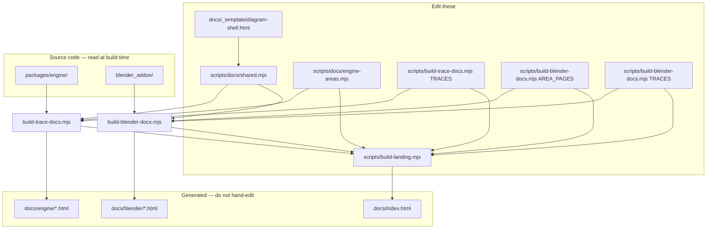

# Building the documentation

This file describes how the kit's documentation is produced, what to edit, and
what is generated. For the product docs themselves, start at
**[index.html](index.html)** (searchable landing page) or the
**[engine](engine/00-INDEX.md)** / **[Blender](blender/00-INDEX.md)** indexes.

---

## Two kinds of documentation

| Kind | Location | How it is maintained |
|------|----------|----------------------|
| **Interactive HTML** | `docs/engine/*.html`, `docs/blender/*.html`, `docs/index.html` | **Generated** — edit build scripts and data files, then run `npm run docs:build` |
| **Prose chapters** | `docs/engine/*.md`, `docs/blender/*.md`, other `docs/*.md` | **Hand-authored** — edit the `.md` files directly; no build step |

The interactive pages are clickable node graphs and step-by-step **code traces**
that pull live source from `packages/engine/` and `blender_addon/`. The Markdown
chapters are longer-form narrative (architecture, workflow, feature traces in
prose, style guide, test plan, etc.).

---

## Build commands

All commands run from the **repository root**.

| Command | What it rebuilds |
|---------|-------------------|
| `npm run docs:build` | Everything — engine HTML, Blender HTML, landing page |
| `npm run docs:trace` | `docs/engine/` only (area diagrams + runtime traces) |
| `npm run docs:blender` | `docs/blender/` only (area diagrams + add-on traces) |
| `npm run docs:landing` | `docs/index.html` only (searchable index) |

`docs:build` is the one to use after any doc change. It runs, in order:

1. `scripts/build-trace-docs.mjs` → `docs/engine/`
2. `scripts/build-blender-docs.mjs` → `docs/blender/`
3. `scripts/build-landing.mjs` → `docs/index.html`

The Babylon Launcher can also trigger a build via `POST /api/docs/build` (see
[launcher docs](launcher/01-LAUNCHER.md)).

---

## Architecture



---

## Interactive HTML: the shared shell

Every diagram and trace page is assembled from one template:

**`docs/_template/diagram-shell.html`**

The shell contains the viewer UI (pan/zoom canvas, node panel, toolbar, import/export
of diagram JSON). Build scripts inject:

- **`DIAGRAM_DATA`** — JSON for nodes, edges, title
- **`<title>`** — page title
- **Bottom nav** — links to sibling area/trace pages (engine = blue, Blender = amber)
- **Body patches** — resizable side panel; trace pages add a code block panel

To change viewer behaviour or styling for **all** diagram pages, edit the shell
once and run `npm run docs:build`.

Assembly lives in `scripts/docs/shared.mjs` → `EmitDiagramPage()`.

---

## Area diagrams vs code traces

### Area diagrams

High-level subsystem maps: boxes and arrows, hand-authored content, **no** source
extraction.

| Side | Data file | Output |
|------|-----------|--------|
| Engine | `scripts/docs/engine-areas.mjs` → `ENGINE_AREA_PAGES` | `docs/engine/index.html`, `load-pipeline.html`, `physics.html`, … |
| Blender | `scripts/build-blender-docs.mjs` → `AREA_PAGES` | `docs/blender/index.html`, `data-model.html`, `export.html` |

Each page entry has:

- **`navLabel`** (engine only) — short label in the bottom nav
- **`diagram`** / **`nodes` + `edges`** — graph data (`id`, `x`, `y`, `w`, `h`, `label`, `sub`, `desc`, `meta` rows)

Blender area pages use helpers `N()` and `E()` from `shared.mjs` for nodes and
edges. Engine area pages use plain JSON objects (same shape).

### Code traces

Step-by-step walkthroughs along a feature path. Each step is either:

- **`{ file, symbol, note }`** — build extracts the function/class from disk
- **`{ title, code, note }`** — inline snippet (e.g. manifest JSON); no extraction

| Side | Definition | Source roots |
|------|------------|--------------|
| Engine | `TRACES` in `scripts/build-trace-docs.mjs` | `packages/engine/`, `apps/` (for examples) |
| Blender | `TRACES` in `scripts/build-blender-docs.mjs` | `blender_addon/` |

Output files are named **`trace-<id>.html`** (e.g. `trace-physics.html`).

Trace pages use a wider code panel (`CODE_PANEL_PATCH_*` in `shared.mjs`). Clicking
a step shows the extracted source and file:line.

---

## Symbol extraction (anti-rot)

Before writing trace HTML, the build **reads the real source** and embeds it in
each step:

- **TypeScript** — `ExtractSymbol()` in `shared.mjs` (functions, classes, `const`
  exports; includes JSDoc above the symbol when present)
- **Python** — `ExtractPySymbol()` (function or class body by indentation)

If a `symbol` is missing or renamed, the build prints `MISSING: …`, sets exit
code 1, and **does not write** trace pages for that packet. This keeps docs from
silently showing stale code.

After changing a traced function's name or file, update the `TRACES` array and
re-run the appropriate `docs:*` command.

---

## Landing page and search

**`docs/index.html`** is fully generated by `scripts/build-landing.mjs`.

It indexes every area diagram and trace from the same data structures the diagram
builders use, so search stays in sync with the graphs. Features:

- Full-text ranking over titles, summaries, and node/step text
- **Synonym map** (`SYNONYMS` in `build-landing.mjs`) — e.g. "collision" also
  matches collider/physics pages
- Suggestion chips under the search box
- `?q=` URL parameter for deep links

To improve search for a new topic, add synonyms or ensure the new page's `desc` /
`note` fields use words people will search for.

---

## File reference

| Path | Role |
|------|------|
| `scripts/build-docs.mjs` | Orchestrator — calls engine, Blender, landing builders |
| `scripts/build-trace-docs.mjs` | Engine area + trace pages; exports `TRACES`, `BuildEngineDocs` |
| `scripts/build-blender-docs.mjs` | Blender area + trace pages; exports `AREA_PAGES`, `TRACES`, `BuildBlenderDocs` |
| `scripts/build-landing.mjs` | Searchable `docs/index.html`; exports `BuildLandingPage` |
| `scripts/docs/shared.mjs` | Shell read, page emit, nav HTML, layout patches, symbol extraction, `N`/`E` helpers |
| `scripts/docs/engine-areas.mjs` | Engine area diagram data only |
| `docs/_template/diagram-shell.html` | Shared interactive viewer (CSS + JS) |

---

## Common tasks

### Regenerate after a code change

If you only changed implementation and trace symbols are unchanged:

```bash
npm run docs:build
```

### Add an engine code trace

1. Append an object to `TRACES` in `scripts/build-trace-docs.mjs` (`id`, `title`,
   `intro`, `steps`).
2. Use `{ file: "packages/engine/…", symbol: "FunctionName", note: "…" }` for
   live extraction.
3. Run `npm run docs:trace` (or `docs:build`) and fix any `MISSING` errors.
4. Optionally add a prose section in `docs/engine/09-FEATURE-TRACES.md`.

The new page appears in the bottom **Traces** nav automatically. The landing page
indexes it automatically.

### Add a Blender code trace

Same as above, but edit `TRACES` in `scripts/build-blender-docs.mjs` and use
`blender_addon/…` paths. Run `npm run docs:blender`.

### Add or edit an area diagram

- **Engine:** edit `scripts/docs/engine-areas.mjs` (`ENGINE_AREA_PAGES`).
- **Blender:** edit `AREA_PAGES` in `scripts/build-blender-docs.mjs`.

Adjust `x`/`y` for layout. Re-run `docs:build`. Nav labels come from `navLabel`
(engine) or `page.title` (Blender).

### Add a prose chapter

Create or edit a `.md` file under `docs/engine/` (or elsewhere). Link it from
`docs/engine/00-INDEX.md`. No npm script required.

### Change diagram viewer UI

Edit `docs/_template/diagram-shell.html`, then `npm run docs:build`.

---

## What not to edit

These files are **overwritten** on every build:

- `docs/index.html`
- `docs/engine/*.html`
- `docs/blender/*.html`

Generated HTML includes a comment pointing at the shell or `build-landing.mjs`.
Hand-edits will be lost on the next `docs:build`.

---

## Viewing locally

Open `docs/index.html` in a browser (file:// or via a static server). The
playground and launcher can serve `/docs` after a build. Diagram pages are
self-contained single HTML files — no bundler required.

---

## Related docs

- [Engine index](engine/00-INDEX.md) — runtime overview + prose chapter list
- [Blender index](blender/00-INDEX.md) — add-on overview
- [Feature traces (prose)](engine/09-FEATURE-TRACES.md) — parallel text version of trace chains
- [Style guide](STYLE_GUIDE.md) — code conventions (separate from this build guide)
