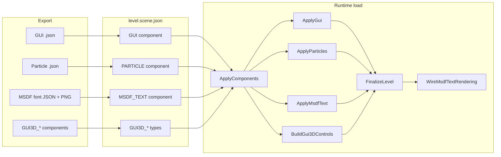
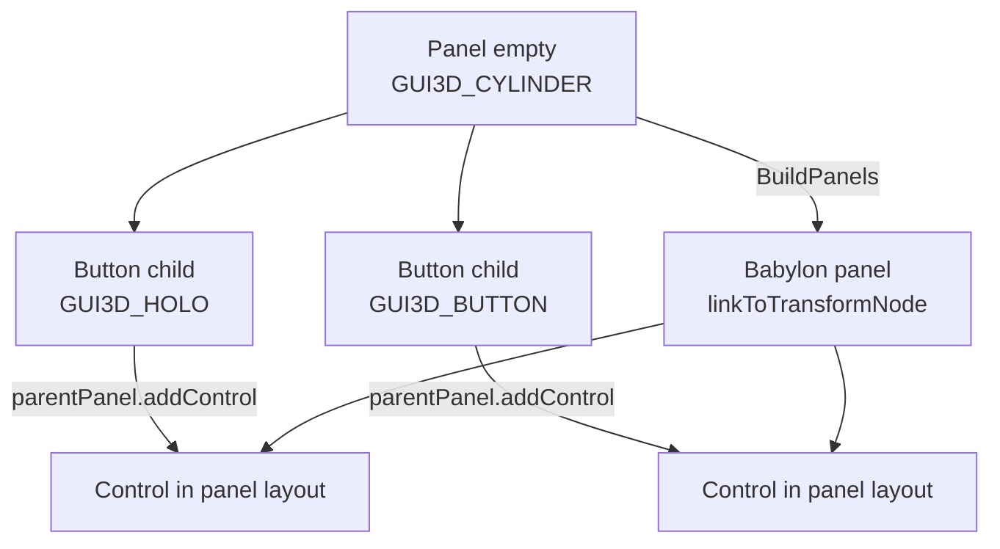
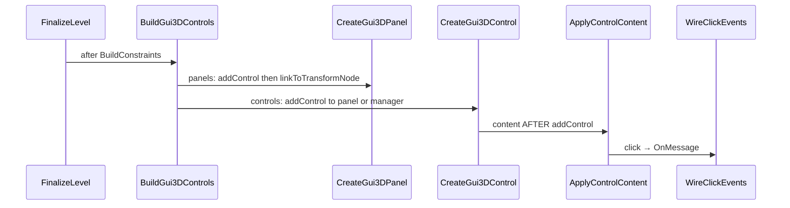

# 10 — UI (2D GUI, particles, MSDF text, 3D GUI)

[← Index](00-INDEX.md) · Prev: [Feature Traces](09-FEATURE-TRACES.md)

Interactive diagram: **[ui.html](ui.html)** · Traces:
[2D GUI](trace-gui.html) · [Particles](trace-particles.html) ·
[MSDF text](trace-msdfText.html) ·
[3D GUI runtime](trace-gui3d.html) · [3D GUI authoring](../blender/trace-gui3d.html)

Engine code lives under `packages/engine/src/ui/` (2D + 3D GUI + MSDF text) and
`packages/engine/src/subsystems/particles.ts` (particle JSON loading).

## Overview

Three related but distinct UI/media paths share the same loader pattern:
**queue async work during the entity pass, settle in `FinalizeLevel`**. 3D GUI
is different — it is fully synchronous but deferred to a **post-pass** because
panels must exist before child controls and click targets must resolve through
the finished `Level`.

## 2D GUI (`GUI` component)

Authored in Blender with a file picker pointing at a layout saved by
[Babylon's GUI Editor](https://gui.babylonjs.com). Export copies the JSON into
`gui/` via `copy_asset` (stable sanitized name; re-export overwrites).

| Mode | Babylon API | Requirement |
|---|---|---|
| **FULLSCREEN** | `AdvancedDynamicTexture.CreateFullscreenUI` | Any entity node (typically an empty) |
| **MESH** | `AdvancedDynamicTexture.CreateForMesh` | Entity node must be a mesh |

Runtime: `ui/gui2d.ts` → `ApplyGui` → `entity.guiTextures` +
`RegisterAttachment`. Lookup: `entity.GetAttachment("GUI")?.texture`,
`entity.GetGui("hud")` (file stem) → `texture.getControlByName(...)`.

## Particles (`PARTICLE` component)

Authored with a file picker for a system saved by
[Babylon's Particle Editor](https://particles.babylonjs.com). Export copies
into `particles/`.

Runtime: `subsystems/particles.ts` → `ParticleHelper.ParseFromFileAsync`.
Options: GPU when supported, `autoStart`, `attachToEntity` (mesh emitter or
empty position), optional `capacity` override. Lookup:
`entity.GetAttachment("PARTICLE")?.system`, `entity.GetParticles("fire")`.

## MSDF text (`MSDF_TEXT` component)

Authored in Blender with paragraph **Text**, a BMFont **Font JSON**, and the
paired glyph atlas **Font Texture** PNG. Generate assets with
[msdf-bmfont](https://msdf-bmfont.donmccurdy.com/) or
[msdfgen](https://github.com/Chlumsky/msdfgen); export copies both into `fonts/`
via `copy_asset`.

Runtime: `ui/msdfText.ts` → `FontAsset` (cached per scene) +
`TextRenderer.CreateTextRendererAsync` → parent to `entity.node` →
`addParagraph` with authored align/wrap/stroke/billboard options →
`entity.textRenderers` + `RegisterAttachment`. After `SettleTasks`,
`WireMsdfTextRendering` hooks `scene.onAfterRenderObservable` to call
`renderer.render(view, projection)` for every label (`level.msdfTextManager`,
disposed with the level).

Lookup: `entity.GetAttachment("MSDF_TEXT")?.renderer`,
`entity.GetTextRenderer("roboto-regular")` (JSON file stem). Dynamic copy:
`clearParagraphs()` then `addParagraph(...)`. Depends on `@babylonjs/addons`
(peer dep, like `@babylonjs/gui`).

## 3D GUI (`GUI3D_*` components)

No external editor — Blender is the layout tool. **One component per Babylon
control type**:

| Component | Babylon class | Role |
|---|---|---|
| `GUI3D_BUTTON` | `Button3D` | Text/image on a 3D plate |
| `GUI3D_HOLO` | `HolographicButton` | MRTK-style + tooltip |
| `GUI3D_TOUCH_HOLO` | `TouchHolographicButton` | + XR near-touch |
| `GUI3D_MESH` | `MeshButton3D` | Entity mesh is the control |
| `GUI3D_STACK` | `StackPanel3D` | Row/column layout |
| `GUI3D_SPHERE` | `SpherePanel` | Children on a sphere |
| `GUI3D_CYLINDER` | `CylinderPanel` | Children on a cylinder |
| `GUI3D_PLANE` | `PlanePanel` | Children on a plane |
| `GUI3D_SCATTER` | `ScatterPanel` | Randomized scatter layout |

### Hierarchy (Blender parenting)

Parent button objects under the panel empty (Ctrl+P). Child transforms express
**membership only** — the panel arranges controls at runtime. Standalone buttons
(no panel parent) are added to the manager root and `linkToTransformNode`'d to
follow their anchor. `GUI3D_MESH` keeps the mesh's own world placement.

### Click events

Each button's **On Click Events** list (target + message) mirrors trigger
collider rows. At runtime `WireClickEvents` subscribes to
`onPointerClickObservable` and calls `target.SendMessage(message, buttonEntity)`
— behaviors handle it via `OnMessage`, same as trigger volumes.

### Build order (critical)

Babylon silently drops button content set before `addControl` — see
`ui/gui3d/controls.ts`.

### Runtime API

- `level.gui3DManager` — shared manager (disposed with level)
- `entity.controls3D` — every control/panel owned by this entity
- `entity.GetAttachmentsOfType("GUI3D_BUTTON")` — component rows with `control` ref
- `entity.GetControl3D("StartButton")` — named after the Blender object

## Loader integration

In `ApplyComponents` (`entityBuilder.ts`):

- `GUI` → `context.guiTasks.push(ApplyGui(...))`
- `PARTICLE` → `context.particleTasks.push(ApplyParticles(...))`
- `MSDF_TEXT` → `context.msdfTextTasks.push(ApplyMsdfText(...))`
- `GUI3D_*` → `context.gui3dRegistrations.push({ entity, component, parentId })`

In `FinalizeLevel` (`LevelLoader.ts`):

1. `SettleTasks` for audio, GUI, particle, and MSDF text promises (`allSettled`)
2. `WireMsdfTextRendering` → `level.msdfTextManager` (when any labels exist)
3. `WireTriggerEvents`
4. `BuildConstraints`
5. `BuildGui3DControls` → `level.gui3DManager`
6. `level.Begin()`

## Blender add-on

| Concern | Module |
|---|---|
| Component types + fields | `components/component.py` (+ `GUI3D_CONTROLS` / `GUI3D_PANELS` sets in `components/constants.py`) |
| Panel + click-event UI | `ui/component_draw.py` (`_draw_click_events`) |
| Click row operators | `operators/components.py` (`bjs.gui3d_event_add/remove`) |
| Serialize + copy assets | `export/components.py` (`serialize_components`) + `export/assets.py` (`copy_asset`, `begin_asset_export`, `unique_asset_path`) |
| Validation | `export/validate.py` (`_check_media`, `_check_gui3d`) |

[← Index](00-INDEX.md)
